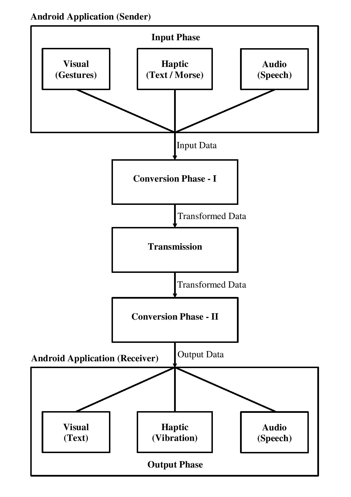

### Update - 19th May, 2020
Winner of *Unisys Cloud 20/20 Year 11*

# Universal Interpreter  
A solution to help the differently-abled people, i.e. deaf, dumb, blind or combination of any, by using Image
Recognition and AI/ML.  

## **Inspiration**  

The present world we live in, a world dominated by visual and audio peripherals, can prove to be
a tough place to live in for differently abled people. Hence, our aim was inspired by the need to
use the very same dominating technologies to help the differently abled overcome their challenges.  

## **Requirements**  
* Python 
* Tensorflow  
* OpenCV  
* Web development/Android tools for UI/Testing  

## **Project Flow**  

### **Phase 1 - Input Phase**    
Collect Data such as Gestures (Sign language), taps (for Morse Code) or direct speech (Voice)
from any client device.  

### **Phase 2 - Conversation and Transmission Phase**    
Convert the input data into some fundamental form (such as Morse/Digital), transmit and process
the data.  

### **Phase 3 - Output Phase**    
Take the output data and represent it either visually, via vibrations or via speech, depending on the following:  
1. Voice/Morse for the Blind
2. Sign-language/Text for the Deaf
3. Sign-language/Voice for the Dumb
4. Morse codes wherever these are not possible  

## **Project Flow - Flowchart**  

## **Android App Implementation**
[Universal Interpreter Android App GitHub Link](https://github.com/allanakshay12/Universal-Interpreter-Android-App.git)

## **Instructions to run the Project**

### Data Set Training and Usage
1. Install all the dependencies from the [requirements.txt](./requirements.txt) file.
2. Prepare the image data sets - In order to start the transfer learning process, a folder named dataset needs to be created in the root of the project folder. This folder will contain the image data sets for all the subjects, for which the classification is to be performed.
3. Create the dataset folder and add the images for all the data sets in the following manner: (This enables classification of images between the A and B data sets.)  
>|  
>----<code>&nbsp;</code>/dataset  
>|<code>&nbsp;</code><code>&nbsp;</code><code>&nbsp;</code><code>&nbsp;</code>|  
>|<code>&nbsp;</code><code>&nbsp;</code><code>&nbsp;</code><code>&nbsp;</code>|  
>|<code>&nbsp;</code><code>&nbsp;</code><code>&nbsp;</code><code>&nbsp;</code>----<code>&nbsp;</code>/A  
>|<code>&nbsp;</code><code>&nbsp;</code><code>&nbsp;</code><code>&nbsp;</code>|<code>&nbsp;</code>A1.jpg  
>|<code>&nbsp;</code><code>&nbsp;</code><code>&nbsp;</code><code>&nbsp;</code>|<code>&nbsp;</code>A2.jpg  
>|<code>&nbsp;</code><code>&nbsp;</code><code>&nbsp;</code><code>&nbsp;</code>|<code>&nbsp;</code>...  
>|<code>&nbsp;</code><code>&nbsp;</code><code>&nbsp;</code><code>&nbsp;</code>|  
>|<code>&nbsp;</code><code>&nbsp;</code><code>&nbsp;</code><code>&nbsp;</code>|  
>|<code>&nbsp;</code><code>&nbsp;</code><code>&nbsp;</code><code>&nbsp;</code>----<code>&nbsp;</code>/B  
>|<code>&nbsp;</code><code>&nbsp;</code><code>&nbsp;</code><code>&nbsp;</code><code>&nbsp;</code><code>&nbsp;</code>B1.jpg  
>|<code>&nbsp;</code><code>&nbsp;</code><code>&nbsp;</code><code>&nbsp;</code><code>&nbsp;</code><code>&nbsp;</code>B2.jpg  
>|<code>&nbsp;</code><code>&nbsp;</code><code>&nbsp;</code><code>&nbsp;</code><code>&nbsp;</code><code>&nbsp;</code>...  
>|   
4. Initiate transfer learning - Go to the project directory and run:
>python train.py \  
><code>&nbsp;</code><code>&nbsp;</code>--bottleneck_dir=logs/bottlenecks \  
><code>&nbsp;</code><code>&nbsp;</code>--how_many_training_steps=2000 \  
><code>&nbsp;</code><code>&nbsp;</code>--model_dir=inception \  
><code>&nbsp;</code><code>&nbsp;</code>--summaries_dir=logs/training_summaries/basic \  
><code>&nbsp;</code><code>&nbsp;</code>--output_graph=logs/trained_graph.pb \  
><code>&nbsp;</code><code>&nbsp;</code>--output_labels=logs/trained_labels.txt \  
><code>&nbsp;</code><code>&nbsp;</code>--image_dir=./dataset  
5. The training summaries, trained graphs and trained labels will be saved in a folder named logs.  
6. To run prediction on the images use " python classify.py _example.png_ ".  
7. To run prediction using a webcam use " python classify_webcam.py ".  

### Android App Usage
1. Download the Android App using this [link](https://drive.google.com/file/d/1JIP3Rifu4HVmTj_o0_8483gyBRdiqz4h/view?usp=sharing) onto your Android Device.
2. Once you've installed the application onto your phone, open it and you'll be welcomed with the *Settings Screen*. Select your input and output preferences, your email-id, and your password. Once you're done, just tap on *Save* and you'll be greeted with the default page of the app.
3. On the default page, tap the right half of the screen to move to the next contact in your chat list. Tap on the left half of the screen to move to the previous contact in your chat list.
4. On the same page, long press the right half of the screen to read the message sent by the displayed contact. Long press the left half of the screen to send a message to a new contact.
5. The *Message Screen* and the *New Message Screen* use similar input methods for entering the text into the textbox. The usage of the screen as an input method is as follows:
>* The Screen is divided into three parts - the Bottom Half (*BH*), the Upper Left Half (*ULH*) and the Upper Right Half (*URH*).  
>* For the Morse input method, tap the *URH* to enter a dot. Long press the *URH* to enter a dash. Tap the *ULH* to delte the previous character from the textbox. Tap the *BH* to enter a space. Long press the *BH* to send the message *or* start a new conversation.  
>* For the Speech input method, tap anywhere on the screen (except the *ULH*) to capture your speech input. Tap the *ULH* to delete the previous character from the textbox. Long press the *BH* to send the message *or* start a new conversation.  
>* For the American Sign Language (ASL) input method, tap anywhere on the screen (except the *ULH*) to open the camera in order to start capturing the sign language input. Once the camera is open, tap anywhere on the screen to stop the camera capture. Tap the *ULH* to delete the previous character from the textbox. Long press the *BH* to send the message *or* start a new conversation.  
>* For the Text input method, tap on the textbox to enter the text via the virtual keyboard. Long press the *BH* to send the message *or* start a new conversation.  
6. Tap the back button on your phone as and when necessary to return to the previous screen.  
  
*Note: Please grant the necessary permissions to the app to ensure smooth running of the application. An internet connection in mandatory.*
